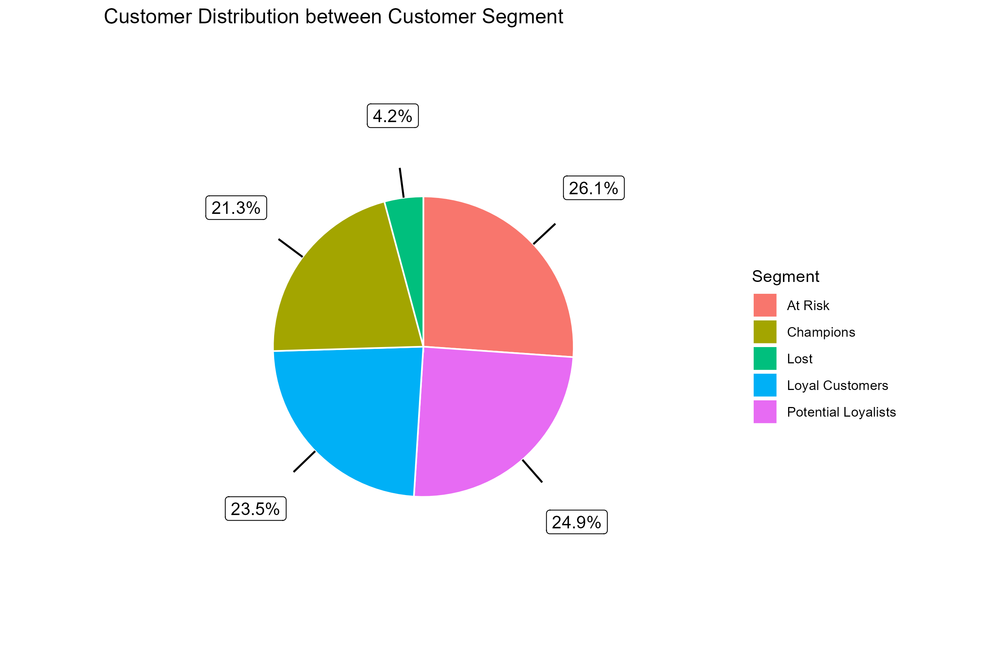
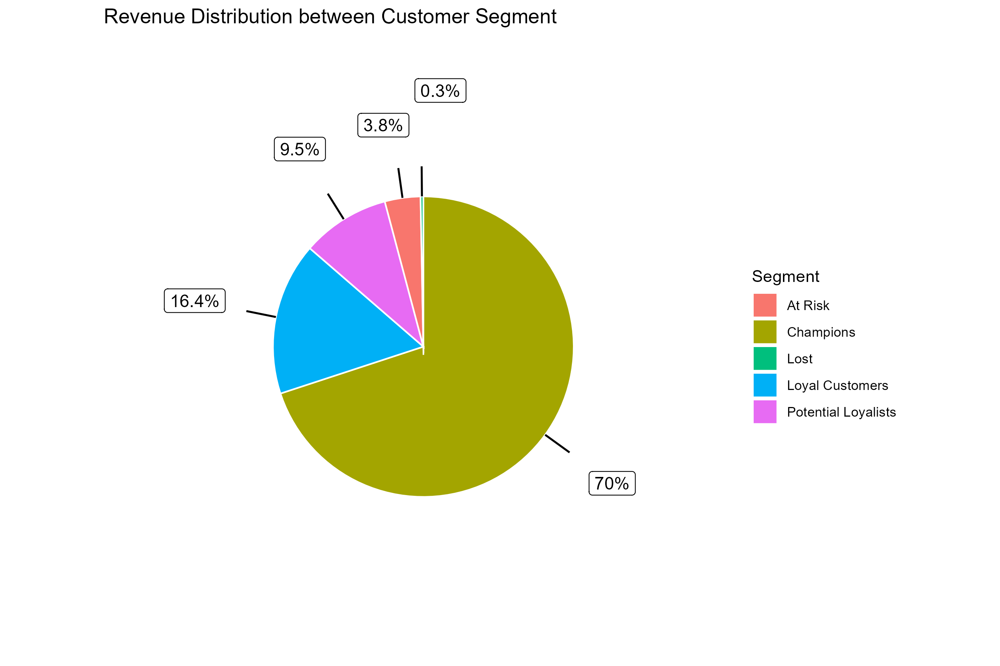

# Online Retail Behavioral Intelligence Framework
**Author:** Ezennia Divine Onyedikachi  
**Date:** February 25, 2026  
**Project Type:** End-to-End Retail Analytics Architecture  
**Focus:** Multi-Dimensional Behavioral Intelligence & Segment Monetization Strategy  

---

## 📋 Project Overview

This project transforms transactional e-commerce data into a **structured behavioral intelligence system**.

Rather than performing a single-layer analysis, this repository implements a **modular, artifact-driven analytical architecture** that converts raw retail transactions into:

- Merchandise dominance intelligence  
- Temporal behavioral dynamics  
- Geographic demand concentration  
- Cross-dimensional contextual performance  
- RFM-based customer segmentation  
- CLV, churn, and AOV evaluation  
- Segment-based monetization strategy  

The system is fully reproducible, deterministic, and enterprise-structured.

This is not a notebook.

It is an analytical engine.

---

# 🏗️ Architectural Blueprint

Full Pipeline Flow:

Raw Transactional Data  
→ Data Cleaning & Standardization  
→ Feature Engineering  
→ Foundational Validation Metrics  
→ Product Intelligence  
→ Temporal Intelligence  
→ Geographic Intelligence  
→ Cross-Dimensional Intelligence  
→ RFM Segmentation Engine  
→ Segment Intelligence Engine  
→ Visualization Engine  
→ Reports Layer  

All intermediate artifacts are persisted as `.rds` objects to ensure:

• Deterministic execution  
• Modular scalability  
• Traceable data lineage  
• Audit-ready documentation  

---

# 🔍 Core Analytical Dimensions

## 1️⃣ Merchandise Intelligence

- Top & Bottom Product Volume
- Revenue Dominance Analysis
- Transaction-Level Efficiency
- Order Penetration Strength

Distinguishes **volume leadership** from **monetary efficiency**.

---

## 2️⃣ Temporal Behavioral Intelligence

- Hour-Level Demand Cycles  
- Day-of-Week Purchase Shifts  
- Weekday vs Weekend Structural Split  
- Seasonal Revenue Concentration  

Supports:

• Campaign timing  
• Inventory forecasting  
• Workforce planning  

---

## 3️⃣ Geographic Market Intelligence

- High-Volume Countries  
- Revenue-Dominant Territories  
- Order-Intensity Concentration  

Enables localized merchandising and monetization strategy.

---

## 4️⃣ Cross-Dimensional Intelligence

Reveals contextual performance:

- Product × Hour  
- Product × Month  
- Product × Country  
- Product × Revenue  
- Product × Order Intensity  

Dominance is situational — not global.

---

## 5️⃣ Customer Segmentation Intelligence (RFM Framework)

Customers are classified into:

- Champions  
- Loyal Customers  
- Potential Loyalists  
- At Risk  
- Lost  

Segment Intelligence includes:

- Revenue Concentration  
- CLV Differentiation  
- Churn Exposure  
- AOV Evaluation  
- Segment × Product Heterogeneity  
- Segment × Country Clustering  

---

## 6️⃣ Tableau-Augmented Behavioral Insights

Beyond static aggregation, this project integrates behavioral visualization insights including:

- Segment-Based Hourly Purchase Intensity  
- Segment-Based Hourly Order Intensity  
- Segment-Based Monthly Revenue Depth  
- Price–Demand Elasticity Relationships  
- Recency–Monetary Behavioral Relationships  
- Frequency–Monetary Behavioral Relationships  

These elevate the system from descriptive reporting to behavioral interpretation.

---

# 💡 Strategic Intelligence Highlights

The system reveals:

• High-CLV segment concentration  
• Revenue dependency on seasonal peaks  
• Segment-specific behavioral timing windows  
• Weak linear price elasticity across product demand  
• Moderate frequency–monetary reinforcement within high-value segments  
• Churn exposure clustering within lower RFM tiers  

Strategic implication:

Monetization must be:

Segment-calibrated  
Time-sensitive  
Context-aware  
Behavior-driven  

---

# 🛠️ Tech Stack

- **R (Tidyverse Ecosystem)**
- dplyr  
- ggplot2  
- ggrepel    
- sf  
- rnaturalearth
- rnaturalearthdata    
- knitr / RMarkdown  
- Tableau (Behavioral Visualization Layer)

---

# 📂 Repository Navigation — Choose Your Journey

| For Executives & Strategy Teams | For Technical Reviewers & Analysts |
|----------------------------------|-------------------------------------|
| 📄 **[Executive Report](./reports/executive/)** Strategic intelligence synthesis | 💻 **[Technical Documentation](./reports/technical/)** Full architecture, reproducibility & artifact governance |
| 📊 **[Executive Presentation](./reports/presentation/)** Board-level behavioral intelligence narrative | 🛠️ **[Modular R Scripts](./scripts/)** Deterministic analytical pipeline |
| 🖼️ **[Visualization Library](./visualizations/)** All exported 300 DPI figures | 📦 **[Processed Artifact Layer](./data/processed/README.md)** Artifact governance documentation |

---

# 📊 Intelligence Gallery Snapshot

All figures are generated reproducibly via the Visualization Engine.

Example structural outputs include:

  
  

If images do not render due to environment restrictions, all figures are accessible within `/visualizations/`.

---

# 🛡 Governance & Reproducibility

This project adheres to:

• Persistent artifact layering  
• Sequential modular execution  
• Structured directory governance  
• Deterministic regeneration protocol  
• Clear abstraction separation (Computation vs Communication)  

No undocumented manual calculations exist.

All insights trace back to reproducible script execution.

---

# 🧠 Why This Project Matters

Most retail analyses stop at dashboards.

This repository demonstrates:

- Architectural thinking  
- Behavioral segmentation maturity  
- Cross-dimensional reasoning  
- Enterprise documentation discipline  
- End-to-end reproducibility  

It is designed to scale.

It is designed to be audited.

It is designed to inform strategic decision-making.

---

# 📌 Final Statement

The Online Retail Behavioral Intelligence Framework transforms transactional e-commerce data into:

Data → Structured Intelligence  
Metrics → Behavioral Insight  
Segmentation → Monetization Strategy  

This repository is deployment-ready, reproducible, and architecturally mature.

End of Framework.
